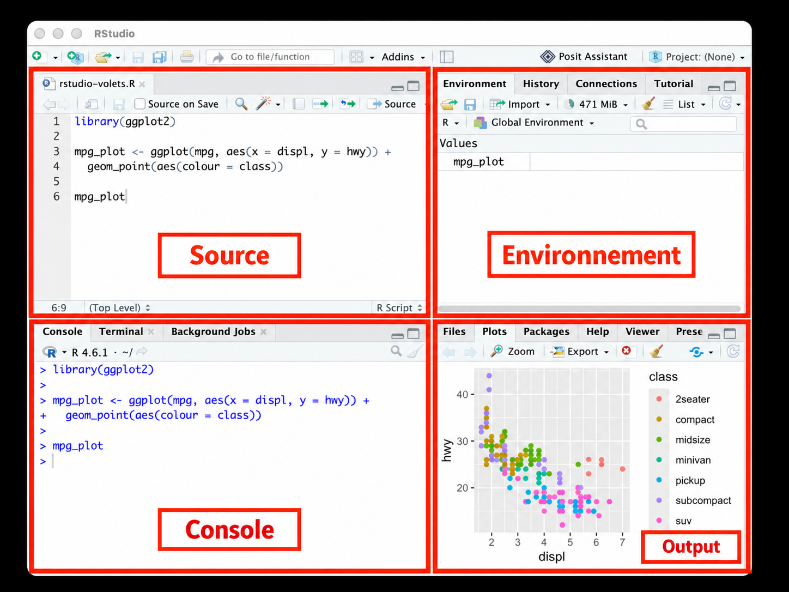

# Premiers pas avec R

```{r}
#| include: false
source("_common.R")
```

**Sujet : Bienvenue, pourquoi R ? et commandes de base I**

Bienvenue ! Ce premier chapitre vous guide dans vos premiers pas avec R :
installer les logiciels, découvrir l'interface RStudio et écrire vos
premières lignes de code.

::: {.callout-note icon="true"}
## À noter

**R** est un langage de programmation et un environnement logiciel pour
l'analyse statistique, la visualisation de données et le calcul
scientifique. Il est largement utilisé par les statisticiens, les
chercheurs en sciences des données et de plus en plus en sciences
sociales y compris en sciences de la communication.

R est idéal pour la manipulation, l'analyse, la modélisation et la
visualisation de données. C'est un logiciel libre et open source, ce qui
signifie qu'il est gratuit à utiliser, modifier et distribuer. Il
dispose d'une grande communauté d'utilisateurs et de développeurs qui
contribuent à son développement et à sa maintenance.
:::

## Installer les logiciels R et RStudio

Pour utiliser R sur votre ordinateur portable, vous devez d'abord
installer les deux logiciels suivants :

1.  le langage de programmation [R](https://cran.r-project.org)
2.  l'interface [RStudio](https://posit.co/download/rstudio-desktop/)

Notez que nous n'écrirons le code R que dans RStudio, l'interface. Le
langage de programmation R doit d'abord être installé, mais il
fonctionnera ensuite en arrière-plan. Il n'est donc pas nécessaire
d'ouvrir R directement sur votre ordinateur par la suite.

## L'interface RStudio

{width="80%" fig-alt="Fenêtre de RStudio avec les volets source, console, environnement et output"}

Pour une présentation détaillée de l'interface, voir la
[documentation de Posit](https://docs.posit.co/ide/user/ide/guide/ui/ui-panes.html).

Dans RStudio, il existe quatre volets différents :

1.  Le volet **source**
2.  Le volet **console**
3.  Le volet **environnement**
4.  Le volet **output**

## Exécuter un script R

Nous travaillons principalement dans le volet **source**, c'est là que
nous écrivons notre code.

Vous pouvez ouvrir le volet source en créant un nouveau **R script**
(cliquez sur le signe plus vert dans le coin supérieur gauche).

Vous pouvez réécrire ou copier-coller le calcul simple suivant et
l'insérer dans votre script :

```{r}
#| echo: true
#| output: false
10+14
```

Une fois que nous avons écrit du code R dans le script, nous pouvons
**l'exécuter** en le sélectionnant et en cliquant sur le bouton
d'exécution situé au-dessus du volet source (le bouton d'exécution avec
la flèche verte à qui montre à droite).

C'est alors dans le volet de la **console** où le résultat va être
affiché :

```{r}
#| echo: false
#| output: true
10+14
```

Notez que le nombre entre crochets indique la **position du premier
élément** affiché sur cette ligne. Ici, il n'y a qu'un élément, donc
`[1]`. Essayez `1:30` pour voir la différence.

Voici quelques autres calculs simples, suivi de leurs résultats :

```{r}
#| echo: true
#| output: true
1+2
99-98
2*10
100/2

2^10
```

::: {.callout-tip title="Astuce"}
Pour exécuter le code R plus rapidement, vous pouvez placer votre
curseur sur une ligne de code à exécuter et utiliser les raccourcis
clavier suivants :

-   Sur **Windows** : <kbd>CTRL</kbd> + <kbd>Enter</kbd>

-   Sur **MacOS** : <kbd>Command</kbd> + <kbd>Enter</kbd>
:::

## Commenter votre code avec un `#`

C'est une bonne pratique de **commenter** son code R. Les commentaires
expliquent ce que le code fait et facilite l'utilisation ultérieure et
aussi le partage de code entre personnes (qui ne savent peut-être pas ce
que vous vouliez faire avec votre code).

On commente en ajoutant un symbole **`#`** au début de la ligne de code,
comme ceci :

```{r}
# Ceci est un commentaire, et R l'ignorera lors de l'exécution du script.
```

## L'opérateur d'affectation `<-`

L'opérateur d'affectation **`<-`** est un opérateur clé de la
programmation R. Il permet d'attribuer des valeurs aux variables.

```{r}
#| echo: true
# Par exemple, nous pouvons attribuer la valeur 5 à la variable x :
x <- 5
```

Si vous exécutez ce code, une nouvelle variable, `x`, sera créée dans le
volet **environnement** en haut à droite de RStudio.



::: {.callout-note icon="true"}
## À noter

En R, tout ce que l'on manipule (une valeur, un vecteur, un tableau, une
fonction) est un **objet** qui porte un nom. On parle aussi de
**structures de données**. Les variables à un élément sont des objets
très simples. Au cours de ce
cours, nous découvrirons d'autres types d'objets.
:::

::: {.callout-tip title="Astuce"}
Vous pouvez créer l'opérateur d'affectation `<-` avec les raccourcis
clavier suivants :

-   Sur **Windows** : <kbd>Alt</kbd> + <kbd>-</kbd>

-   Sur **MacOS** : <kbd>Option</kbd> + <kbd>-</kbd>
:::

## Variables à élément unique

Vous pouvez **imprimer** (afficher) la valeur d'une variable que vous
avez créée, telle que `x`, en tapant le nom de la variable et en
l'exécutant.

```{r}
#| echo: true
x
```

::: {.callout-important title="Important"}
-   Veillez toujours à exécuter votre code pour créer des variables
    avant de les utiliser pour d'autres opérations. Si vous oubliez de
    créer les variables en premier, vous obtiendrez une erreur comme
    résultat.
:::

Par exemple, essayez d'exécuter ce qui suit : `y + z`

Pourquoi cela crée une erreur ? Réponse : les variables `y` et `z` n'on
pas encore été définies !

Pour éliminer l'erreur, nous devons donc définir `y` et `z`.

```{r}
#| echo: true
#| output: true
y <- 7
z <- 3 

# Essayons encore une fois :
y + z
```

Maintenant ça marche ! 😀

::: {.callout-important title="Important"}
-   Sachez aussi que si vous attribuez une nouvelle valeur à une
    variable existante, l'ancienne valeur sera écrasée !
:::

```{r}
#| echo: true
# Notez que si vous exécutez toutes les lignes de code suivantes, la variable x se voit attribuer la dernière valeur exécutée : 4. Les valeurs 5 et 100 sont ecrasées lors de l'exécution du code.
x <- 5
x <- 100
x <- 4
x
```

### Les différents types de variable : numériques, textuelles et logique

Jusqu'à présent, nous avons créé des variables de **type numérique**,
telles que `x` (valeur = 5).

Cependant, ce n'est pas le seul type de variable dans R.

::: {.callout-note icon="true"}
## À noter

Dans R, il existe différents types de variables :

-   les variables **numériques**

-   les variables **textuelles**, également appelées *character strings*
    (chaînes de caractères).

-   les variables **logiques** avec les valeurs TRUE et FALSE (VRAI et
    FAUX)
:::

```{r}
#| echo: true
# Regardons quelques exemples avec du code ! (faut tout exécuter !)

# variables numériques :
a <- 100
b <- 77

age <- 21
Insta_likes <- 1539

# variables textuelles (toujours ajouter des guillemets !)
c <- "chien"
d <- "chat"

Comm_TikTok <- "wsh"
Moliere <- "il n’est rien d’égal au tabac : c’est la passion des honnêtes gens"

# variables logiques :

e <- TRUE
f <- FALSE
```

Les variables logiques peuvent être utiles quand vous travaillez avec
des **catégories binaires**.

Par exemple : il est souvent utile de classer les personnes ayant
répondu à un questionnaire en catégories binaires, telles que :

-   homme/femme

-   mineur/majeur

-   conservateur/libéral

-   etc.

```{r}
#| echo: true
# Si Marc était mineur et Claire majeure, nous les classerions comme suit : 

Marc <- FALSE
Claire <- TRUE

# Dans cet exemple, la variable logique indique si une personne est majeure (TRUE) ou pas (FALSE)

```

## Variables à plusieurs éléments : vecteurs

Les **vecteurs** constituent un autre type de variable (ou type d'objet)
essentiel dans la programmation R. Il s'agit de variables comportant
**plusieurs** éléments.

Vous pouvez créer des vecteurs avec l'opérateur d'affectation `<-` et la
**fonction de concatenation** `c()`.

```{r}
#| echo: true
# Voici quelques exemples avec du code ! (faut tout exécuter !)

# un vecteur numérique (notez qu'il faut toujours séparer les valeurs avec des virgules)
v1 <- c(1, 2, 3)
```

Vous pouvez afficher la valeur de `v1` en tappant son nom et l'exécutant
:

```{r}
#| echo: true
v1 
```

::: {.callout-note icon="true"}
## À noter

En R, une **fonction** est un morceau de code conçu pour effectuer une
tâche spécifique, souvent avec des paramètres variables. Ces paramètres
d'entrée sont également appelés les **arguments** de la fonction.
:::

Prenons l'exemple de la fonction `c()` qui crée des vecteurs :

-   les arguments de cette fonction doivent être insérés entre les
    **parenthèses** sous la forme de valeurs séparées par des virgules (pour
    chaque élément du vecteur).

-   Un vecteur à deux éléments : `c(2, 4)`

-   Un vecteur à trois éléments : `c(3, 6, 9)`

Maintenant, regardons encores quelques exemples de vecteurs de
**différents types** :

```{r}
#| echo: true
# vecteurs numériques 
w <- c(-10, 100, 4, -88)

likes_comments_shares <- c(513, 34, 102)

# vecteurs textuels (toujours ajouter des guillemets pour chaque élément !)
animaux <- c("chat", "chien", "cheval", "chenille")

Comm_Insta <- c("trop cool", "wsh", "c'est quoi ?")

humains <- c("Claire", "Clarissa", "Theresa", "Marc", "Alma")

# vecteurs logiques :
femme <- c(TRUE, TRUE, TRUE, FALSE, TRUE)

```

::: {.callout-caution collapse="false"}
## Attention

Un vecteur ne contient qu'**un seul type** de données. Si l'on mélange
des types, R les convertit sans prévenir vers le type le plus général
(logique → numérique → texte) : `c(1, "a", TRUE)` donne
`"1" "a" "TRUE"`.
:::

## À faire avant de continuer {#devoir-pour-session-2 .unnumbered}

-   Si ce n'est pas encore fait : Installez R et RStudio sur votre
    ordinateur.

-   Lisez ensuite encore une fois ce script et exécutez toutes les
    sections de code sur votre ordinateur.

-   Essayez de résoudre vous-même les éventuels messages d'erreur en
    adaptant le code.

## Exercices {.unnumbered}

Choisissez *Vrai* ou *Faux*, cochez une réponse ou tapez un nombre : la couleur indique tout de suite si votre réponse est correcte. Cliquez sur **Explication** pour voir la correction.

```{r}
#| echo: false
#| results: asis
#| message: false
#| warning: false
exercices(session = 1)
```
