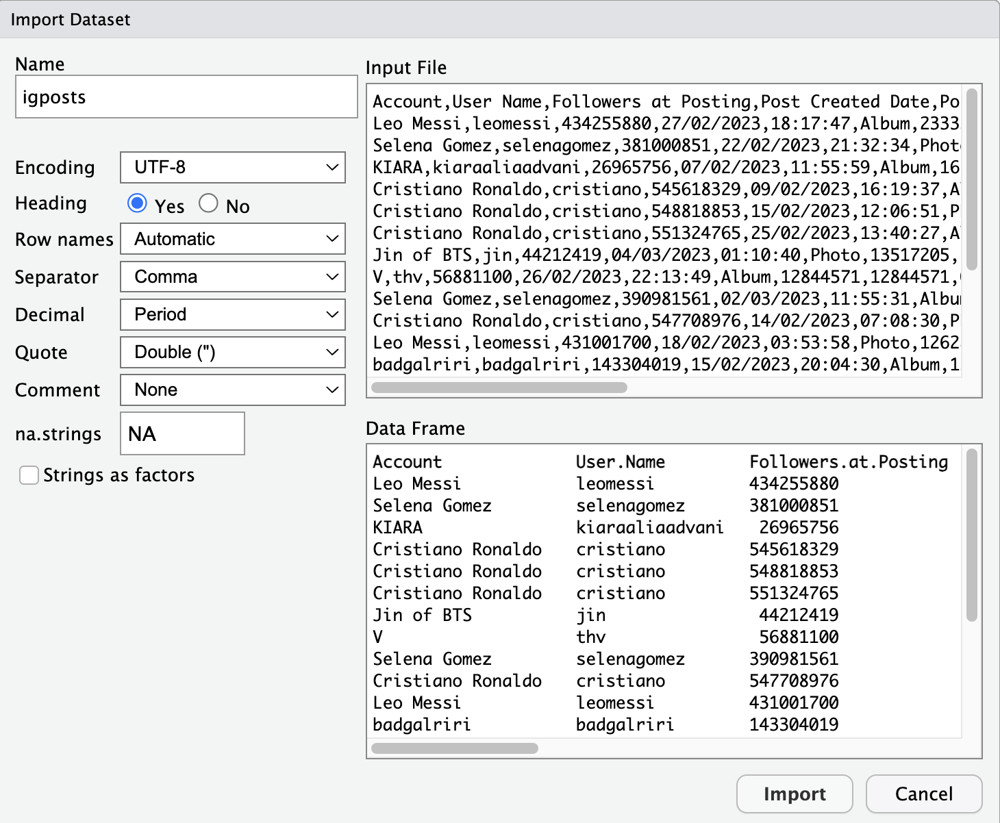

# Importer et manipuler des données

```{r}
#| include: false
source("_common.R")
```

::: {.callout-important title="Objectifs d'apprentissage"}
-   Importer un fichier CSV dans R et vérifier sa structure.
-   Convertir une variable dans le type adapté (`as.numeric()`,
    `as.factor()`).
-   Enchaîner des opérations avec le pipe.
-   Sélectionner, créer, filtrer, trier, résumer et compter des données
    avec les verbes de `dplyr`.
:::

Les jeux de données d'exemple des chapitres 4 et 5 étaient prêts à
l'emploi. Les données réelles arrivent sous forme de fichiers qu'il faut
importer, vérifier et souvent transformer avant de pouvoir les analyser.
Ce chapitre vous montre comment, à partir d'un échantillon de posts
Instagram, avec le package `dplyr` (prononcé « dee-ply-er » en anglais)
du tidyverse.

## Lire des données au format CSV dans RStudio {#lire-des-données-auf-format-csv-dans-rstudio}

Par la suite, nous allons appliquer `dplyr` pour manipuler les données
d'un jeu de données concret : un fichier CSV nommé `igposts.csv`. Ce
fichier contient des posts Instagram de célébrités qui ont reçu
beaucoup d'interactions. Pour cette application, il faut
d'abord charger ce jeu de données dans notre session RStudio en cours.

::: {.callout-caution title="Contexte : d'où viennent ces données ?" collapse="true"}
`igposts.csv` reprend les posts d'un échantillon de février–mars 2023
qui étaient encore publics le 5 octobre 2026. Les métriques (`Likes`,
`Comments`, `Reposts`) et le nombre de followers ont été relevés à cette
date : ils décrivent l'état des posts en 2026, pas au moment de leur
publication. Voir [À propos](../apropos.qmd#données) pour les détails.
:::

::: {.callout-note title="Définition : fichier CSV"}
Un fichier de type **CSV** (angl. *comma-separated values*) est un format
textuel simple pour sauvegarder des données en forme de tableau, c'est à
dire avec des valeurs organisées en lignes et en colonnes et séparées par
des virgules.

Le format CSV présente l'avantage d'être assez léger et compatible avec
tous les systèmes d'exploitation. En outre, il est utile pour stocker
des données quantitatives en sciences sociales, qui se présentent
souvent sous forme de tableaux.

Voici un exemple de format CSV simple :

nom, prénom, âge\
Leclerc, Antoine, 53\
Gomez, Hugo, 25\
Nguyen, Laetitia, 19\

Que nous pouvons afficher comme tableau (à noter que la première ligne
désigne les noms des colonnes) :

| nom     | prénom   | âge |
|:--------|:---------|:---:|
| Leclerc | Antoine  | 53  |
| Gomez   | Hugo     | 25  |
| Nguyen  | Laetitia | 19  |
:::

Avant d'importer un fichier CSV, ouvrez votre projet RStudio (voir le
[chapitre 2](session-02.qmd#projets-rstudio)) et chargez les packages
nécessaires :

```{r}
library(tidyverse)
```

Pour charger le jeu de données `igposts.csv` dans RStudio, vous pouvez
suivre le processus suivant :

1.  Téléchargez le fichier [`igposts.csv`](../data/igposts.csv)
    (clic droit → « Enregistrer le lien sous… »).

2.  Enregistrez le fichier `igposts.csv` dans le dossier de votre projet
    RStudio.

3.  Ensuite, utilisez le menu de RStudio **File → Import Dataset → From
    Text (base)…** et choisissez `igposts.csv`.

4.  Une fenêtre avec des paramètres apparaît, que vous pouvez remplir de
    la manière suivante :

    {fig-alt="Fenêtre Import Dataset de RStudio avec les paramètres d'importation du fichier igposts.csv"}

    -   Explications des paramètres :

        -   **Encoding = UTF-8** : Indique à RStudio d'utiliser
            [l'encodage de caractères
            UTF-8](https://fr.wikipedia.org/wiki/UTF-8) (qui est un
            standard très répandu), ce qui est important pour lire
            correctement toutes les lettres (notamment les caractères
            avec des accents : é, ä, ê, etc.).

        -   **Heading = YES** : Indique à RStudio que la première ligne
            du fichier CSV contient les noms des colonnes.

        -   **Separator = Comma** : Indique à RStudio que les valeurs du
            tableau sont séparées par des virgules « , » (attention,
            certains documents francophones utilisent le point-virgule
            « ; » à la place de la virgule, ce dont il faut alors tenir
            compte).

        -   **Decimal = Period** : Indique à RStudio que le point « . »
            est utilisé pour les décimales (et non la virgule « , » comme
            c'est souvent le cas dans les documents en français).

        -   **na.strings = NA** : valeur par défaut. Ce fichier n'a pas
            de valeurs manquantes ; dans d'autres fichiers (p. ex. exports
            Excel), elles peuvent être codées autrement, p. ex. #N/A.

5.  Finalement, vous pouvez copier et coller le code qui apparaît dans
    la console dans votre script R pour facilement recharger le fichier
    CSV ultérieurement.

```{r}
# Par exemple, en lisant le fichier directement depuis le site du livre :

igposts <- read.csv("https://julesaberlin.github.io/intro-a-R/data/igposts.csv", encoding="UTF-8")
 
# Si tout a bien marché, l'objet igposts devrait apparaître dans votre environnement
# Nous pouvons afficher la structure de igposts pour une première impression :

str(igposts)
```

Si le fichier se trouve dans le dossier de votre projet, il suffit
d'indiquer son nom : `read.csv("igposts.csv", encoding = "UTF-8")`.
L'argument `stringsAsFactors = TRUE` (case **Strings as factors** de la
fenêtre d'importation) convertirait directement toutes les colonnes de
texte en facteurs ; nous le faisons plus loin colonne par colonne, avec
`as.factor()`.

## Explorez votre jeu de données importé

Cela nous montre qu'il s'agit d'un tableau de données avec 84 observations et
11 variables. Chaque ligne (unité statistique) représente une observation
associant un post Instagram à un compte qui l'a publié ou co-publié : les
84 lignes correspondent à 82 posts distincts provenant de 33 comptes.
Chaque colonne est une variable différente associée à cette observation.

Notez que les variables sont soit de type caractère (`chr`, pour
*character* ; p. ex. `Account`, le nom du compte Instagram qui a publié
le post), soit numérique (`int`, pour *integer* ; p. ex.
`Total.Interactions`, la somme des `Likes` et des `Comments` qu'un post
a reçus).

Vous pouvez aussi cliquer sur l'objet et explorer le tableau
manuellement pour le comprendre davantage (comme nous l'avons fait avec
`mtcars`, etc.).

::: {.callout-warning title="Attention"}
-   N'enregistrez pas un fichier CSV après l'avoir ouvert dans Excel
    (ou un autre tableur) : Excel peut modifier les dates, les zéros
    initiaux, le séparateur ou l'encodage, ce qui entraîne ensuite des
    erreurs dans R.

-   Vous devriez enregistrer le fichier CSV directement dans votre
    répertoire de travail sans l'ouvrir, puis l'importer dans RStudio à
    l'aide du menu interactif.

-   Vous devriez également éviter d'ouvrir le fichier CSV avec des
    applications ou autres (p. ex. une application mobile), ce qui peut
    également entraîner des erreurs.

-   Il est préférable de télécharger les fichiers CSV avec des
    navigateurs standard tels que Chrome ou Safari.
:::

Avant de continuer avec `dplyr`, regardons encore deux éléments
cruciaux pour la manipulation de données avec R :

-   la transformation du type de variable (p. ex. de variables de
    type caractère en facteurs) ;

-   le pipe `%>%`.

## La transformation du type de variable

Lorsque l'on analyse des jeux de données, on constate parfois que toutes
les variables **ne sont pas enregistrées dans un format utile pour
l'analyse**. Parfois, par exemple, les valeurs numériques sont
enregistrées sous forme de texte. Il est alors utile de les transformer
dans un format numérique (par exemple avec la fonction `as.numeric()`).

Mais il y a aussi le cas suivant : les variables sous forme de texte ne
représentent pas simplement des textes, mais certaines **catégories**.
Dans ce cas, il est judicieux de les transformer en une variable
catégorielle, c'est-à-dire un facteur, à l'aide de la fonction
`as.factor()`.

Dans notre exemple de jeu de données `igposts`, qui contient des
métriques sur les posts Instagram, nous pouvons justement constater
cela. Certes, certaines variables de type caractère, telles que `URL` (le lien
vers le post), sont tout à fait pertinentes. D'autres, en revanche, sont
des catégories. La plus évidente est la variable `Type`, qui indique si
un post Instagram est une photo ou un album (les deux catégories présentes
dans `igposts`). Factorisons
ci-dessous quelques-unes de ces variables catégorielles à l'aide de code
:

```{r}
# Transformons les colonnes "Account", "User.Name" et "Type" en facteurs :

igposts$Account <- as.factor(igposts$Account)

igposts$User.Name <- as.factor(igposts$User.Name)

igposts$Type <- as.factor(igposts$Type)

# Vérifier, si ça a marché :

str(igposts)

```

Nous allons voir par la suite pourquoi ces factorisations sont utiles.

## L'opérateur `%>%`

Le pipe `%>%` transmet l'objet placé à sa gauche comme **premier
argument** de la fonction placée à sa droite : `x %>% f(y)` équivaut à
`f(x, y)`. On peut ainsi enchaîner plusieurs fonctions dans l'ordre où
on les lit, au lieu de les imbriquer.

```{r}
# Par exemple, regardez la fonction suivante : quel est le problème ?

log(sqrt(mean(c(1:100))))

# Le problème est que cette fonction est imbriquée et, à cause de cela, difficile à lire

# Avec le pipe, nous pouvons réécrire cette fonction comme ça et obtenir le même résultat après exécution du code :

c(1:100) %>% mean() %>% sqrt() %>% log()
```

::: {.callout-tip title="Astuce"}
Vous pouvez créer le pipe `%>%` avec les raccourcis clavier suivants :

-   Sur **Windows** : <kbd>Ctrl</kbd> + <kbd>Maj</kbd> + <kbd>M</kbd>

-   Sur **macOS** : <kbd>Cmd</kbd> + <kbd>Maj</kbd> + <kbd>M</kbd>

De plus, vous pouvez aussi utiliser le pipe natif de R, `|>` (depuis
R 4.1). Il fonctionne sans package et s'utilise de la même façon que
`%>%` dans les cas simples.
:::

Vous pouvez déjà constater que travailler avec des jeux de données du
monde réel, tels que le jeu de données Instagram `igposts`, nécessite un
travail préparatoire substantiel. Mais rassurez-vous et ne vous
découragez pas, plus vous pratiquez, plus cela devient facile et,
bientôt, vous serez en mesure de charger facilement des jeux de
données dans RStudio. Par ailleurs, il est normal de rencontrer des
messages d'erreur. C'est une partie essentielle du processus
d'apprentissage que de les surmonter en bricolant et en jouant avec vos
données et votre code R jusqu'à ce que vous puissiez le faire
fonctionner.

Après avoir chargé notre fichier CSV dans RStudio, appliqué des
transformations et notre connaissance de l'opérateur pipe, nous pouvons
maintenant manipuler les données avec le package `dplyr`.

## Manipuler les données avec `dplyr`

Les verbes de `dplyr` renvoient souvent un **tibble** : une version
moderne du tableau de données, qui s'affiche de façon plus compacte dans
la console (première ligne `# A tibble: …`, type de chaque colonne sous
son nom). On l'utilise exactement comme un tableau de données.

Le package `dplyr` est basé sur une logique de *verbes* pour les
différents types de manipulation de données, notamment :

-   Les verbes pour manipuler les données au niveau de **colonnes** :

    -   `select()` : pour extraire une ou plusieurs colonnes d'un tableau
        de données.

    -   `mutate()` : pour créer une ou plusieurs nouvelles colonnes dans
        un tableau de données.

-   Les verbes pour manipuler les données au niveau de **lignes** :

    -   `filter()` : pour filtrer les lignes d'un tableau de données selon un ou
        plusieurs critères.

    -   `arrange()` : pour trier les lignes d'un tableau de données selon un ou
        plusieurs critères.

-   Les verbes pour **résumer, compter et regrouper** les données :

    -   `summarize()` : pour réduire une ou plusieurs colonnes d'un tableau
        de données en une seule ligne, notamment pour résumer des données.

    -   `count()` : pour compter le nombre d'observations d'une ou
        plusieurs catégories dans un tableau de données.

    -   `group_by()` : pour regrouper des données d'un tableau de données selon
        une ou plusieurs catégories.

Essayons maintenant d'appliquer tout cela avec du code et les données
`igposts` pour voir ce que cela donne en pratique.

## Manipulation de colonnes : `select()` et `mutate()` {#manipulation-de-colonnes-selectet-mutate}

```{r}
#| echo: true
#| output: false
# select() : fonction pour extraire une ou plusieurs colonnes d'un tableau de données

# Par exemple, nous pouvons extraire les quatre colonnes suivantes d'igposts (voir comment le pipe est utilisé) :

igposts %>% select(Account, Type, Followers.at.Observation, Total.Interactions)

# Avec les deux points dans la fonction select(), vous pouvez sélectionner plusieurs colonnes successives. Notez que cette fois-ci, nous affichons que les six premières lignes avec la fonction head() :

igposts %>% 
  select(Account:Reposts) %>% 
  head()

# Vous pouvez également créer un nouvel objet, df1, qui est essentiellement un tableau de données plus petit que igposts avec un sous-ensemble de variables (un tel data frame plus petit peut être plus utile à analyser et à afficher) :
  
df1 <- igposts %>% 
          select(Account, 
                 Type, 
                 Followers.at.Observation, 
                 Total.Interactions,
                 URL)


###############################################################################


# mutate() : fonction pour créer une ou plusieurs nouvelles colonnes dans un tableau de données

# Par exemple, nous pouvons créer une nouvelle colonne qui compte le nombre d'interactions par follower :

df1 %>% mutate(TI_par_Follower = Total.Interactions/Followers.at.Observation)

# Attention : sans l'opérateur <-, l'objet df1 n'est pas modifié.
# Pour ce faire et sauvegarder notre nouvelle colonne, nous pouvons écraser df1 avec une nouvelle version de df1 :

df1 <- df1 %>% 
        mutate(TI_par_Follower = Total.Interactions/Followers.at.Observation)

str(df1)
```

## Manipulation de lignes avec `filter()` et `arrange()`

Pour filtrer des lignes, on écrit des conditions avec des **opérateurs
de comparaison** ; chaque condition vaut `TRUE` ou `FALSE` pour chaque
ligne :

| Opérateur | Signification |
|:---:|:---|
| `==` | égal à |
| `!=` | différent de |
| `>`, `>=` | strictement supérieur, supérieur ou égal à |
| `<`, `<=` | strictement inférieur, inférieur ou égal à |
| `%in%` | appartient à (p. ex. `Account %in% c("Leo Messi", "Selena Gomez")`) |
| `!` | négation (p. ex. `!is.na(x)` : x n'est pas manquant) |

: Opérateurs de comparaison

```{r}
#| echo: true
#| output: false
# filter() : fonction pour filtrer les lignes selon un ou plusieurs critères

# Pour filtrer pour une valeur spécifique d'une variable, p. ex. les posts de Cristiano Ronaldo : 

df1 %>% filter(Account == "Cristiano Ronaldo")

# Pour plusieurs valeurs spécifique de la même variable, p. ex. les posts de Ronaldo et Messi :

df1 %>% filter(Account %in% c("Cristiano Ronaldo", "Leo Messi"))

# Pour plusieurs valeurs spécifiques de variables différentes, p. ex. les posts de type Photo de Ronaldo :

df1 %>% 
  filter(Account == "Cristiano Ronaldo", 
         Type == "Photo")

# Filtrer à partir de valeurs numériques, p. ex. les posts avec au moins 10 millions d'interactions :

options(scipen=999) # Cette commande désactive la notation scientifique des nombres

df1 %>% 
  filter(Total.Interactions >= 10000000)

# Filtrer pour les posts de Selena Gomez avec au moins 10 millions d'interactions :

df1 %>% 
  filter(Account == "Selena Gomez", 
         Total.Interactions >= 10000000)

###############################################################################


# arrange() : fonction pour trier les lignes selon un ou plusieurs critères

# Trier par ordre alphabétique (texte ou facteur) :

df1 %>% arrange(Account) %>% head(10)

# Trier par le nombre d'interactions (ordre croissant)

df1 %>% 
  arrange(Total.Interactions) %>% 
  head(10)

# Trier par le nombre d'interactions par follower (ordre décroissant)

df1 %>% 
  arrange(desc(TI_par_Follower)) %>% 
  head(10)
```

## Résumer, compter et regrouper avec `summarize()`, `count()` et `group_by()`

```{r}
#| echo: true
#| output: false
# summarize() : fonction qui réduit une ou plusieurs colonnes en une seule ligne, 
# notamment pour résumer des données

# Nous pouvons, par exemple, résumer la somme totale de Total.Interactions dans notre jeu de données. Ce nombre est assez impressionnant et constitue une caractéristique importante de notre ensemble de données.

df1 %>% summarize(sum_TI = sum(Total.Interactions)) 

# Nous pouvons aussi calculer les moyennes des interactions et de followers de tous les comptes qui ont publié les posts :

df1 %>% 
  summarize(mean_TI = mean(Total.Interactions), 
                  mean_Followers = mean(Followers.at.Observation)) 


###############################################################################


# count() : fonction qui compte le nombre d'observations d'une ou plusieurs catégories

# Compter l'occurrence des types de posts Instagram (Photo et Album, dans ce cas) dans notre jeu de données :

df1 %>% 
  count(Type)

# Compter l'occurrence des différents comptes dans notre jeu de données :

df1 %>% 
  count(Account)

# Compter l'occurrence des différents comptes dans notre jeu de données en les triant par cette occurence de manière décroissante (avec arrange(-n)) :

df1 %>% 
  count(Account) %>% 
  arrange(-n) %>% 
  head(10)


###############################################################################


# group_by() : fonction qui regroupe des données selon une ou plusieurs catégories

# Regroupement par type de post et comparaison du nombre moyen d'interactions par type de post :

df1 %>% group_by(Type) %>% summarize(mean_TI = mean(Total.Interactions)) 

# Avec n = n() dans la fonction summarize(), nous pouvons également compter le nombre d'observations dans chaque catégorie :

df1 %>% 
  group_by(Type) %>% 
  summarize(n = n(), 
            mean_TI = mean(Total.Interactions)) 

# Utilisons plusieurs verbes dplyr pour trouver les 10 comptes qui apparaissent le plus fréquemment dans notre jeu de données de posts Instagram. Nous résumons également leur nombre moyen de followers et d'interactions.

df1 %>% 
  group_by(Account) %>% 
  summarize(n = n(), 
            mean_Followers = mean(Followers.at.Observation),
            mean_TI = mean(Total.Interactions)) %>% 
  arrange(desc(n)) %>% 
  head(10)

# Utilisons plusieurs verbes dplyr pour comparer les Likes et Comments des posts de Ronaldo et Messi :

igposts %>%
  group_by(Account) %>%
  filter(Account %in% c("Cristiano Ronaldo", "Leo Messi")) %>% 
  summarize(n = n(), mean_Followers = mean(Followers.at.Observation),
            mean_Likes = mean(Likes),
            mean_Comments = mean(Comments)) 
```

::: {.callout-important title="En bref"}
-   `read.csv()` importe un fichier CSV ; vérifiez toujours le résultat
    avec `str()`.
-   Une variable qui représente des catégories se convertit en facteur avec
    `as.factor()`.
-   Le pipe transmet le résultat de gauche comme premier argument de la
    fonction de droite : `x %>% f()` équivaut à `f(x)`.
-   `select()` et `mutate()` agissent sur les colonnes, `filter()` et
    `arrange()` sur les lignes ; `summarize()`, `count()` et `group_by()`
    résument les données, au besoin par groupe.
-   Sans `<-`, un verbe de `dplyr` affiche un résultat mais ne modifie pas
    le tableau.
:::

Le chapitre 8 vous propose une série d'exercices pour pratiquer ces
verbes sur `mtcars`, `diamonds`, `iris` et `igposts`.

## À faire avant de continuer {#devoir-pour-session-8-et-infos-questionnaire .unnumbered}

-   Vérifiez que vous savez importer `igposts.csv`, depuis votre
    ordinateur ou directement depuis le site : les chapitres suivants
    utilisent d'autres fichiers CSV.
-   Si les exercices vous posent problème, refaites le code des chapitres
    précédents et assurez-vous de comprendre chaque étape.

## Exercices {.unnumbered}



```{r}
#| echo: false
#| results: asis
#| message: false
#| warning: false
exercices(session = 7)
```
