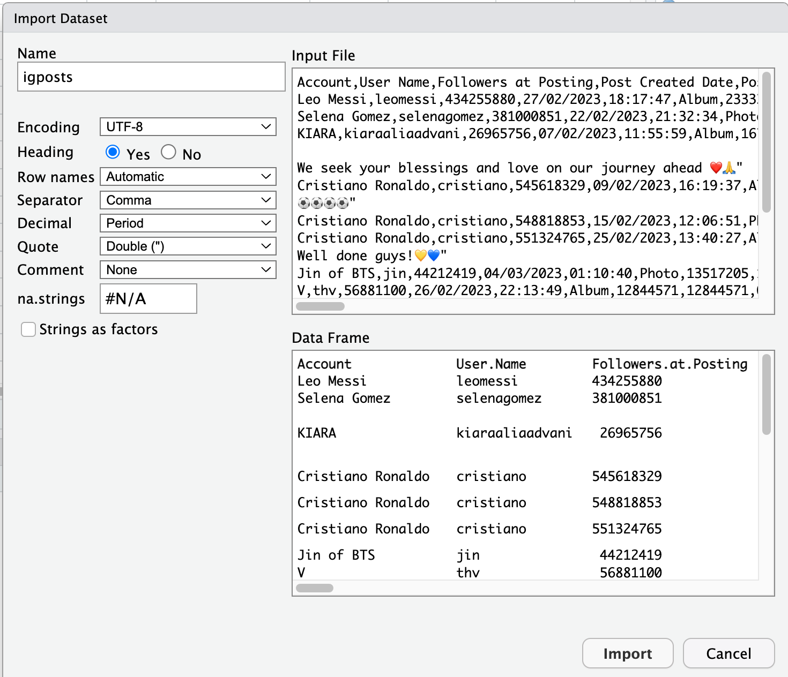

# Manipuler les données I

```{r}
#| include: false
source("_common.R")
```

**Sujet : Manipuler les données (partie 1)**

Le premier but de cette session est d'apprendre à importer des données
dans RStudio à partir de **fichiers CSV** et de les stocker en forme de
data frame (format tabulaire).

Le deuxième but est de se familiariser avec `dplyr` (prononcé
"dee-ply-er" en anglais), un paquet du `tidyverse` conçu pour manipuler
les données en forme de data frame.

Contrairement aux jeux de données intégrés à R (tels que `diamonds`,
etc.), la plupart des jeux de données du monde réel nécessitent des
**transformations** avant de pouvoir être analysés et visualisés. À
cette fin, nous examinerons également certaines transformations de types
de variables et un nouvel opérateur, le `%>%` (angl. "pipe"; trad.
franç. "tuyau"), qui est très utile pour les manipulations de données.

## Lire des données auf format CSV dans RStudio

Par la suite, nous alons appliquer `dplyr` pour manipuler les données
d'un jeu de données concret : un fichier CSV nommé `igposts.csv`. Ce
fichier contient des posts Instagram de célébritées qui ont reçu
beaucoup d'interactions d'utilisateurs. Pour cette application, il faut
d'abord charger ce jeu de données dans notre session RStudio en cours.

::: {.callout-note icon="true"}
## À noter

Un fichier de type **CSV** (angl. comma-separated values) est un format
textuel simple pour sauvegarder des données en forme de tableau, c'est à
dire avec des valeurs organisé par lignes et colonnes et séparées par
virgules.

Le format CSV présente l'avantage d'être assez léger et compatible avec
tous les systèmes d'exploitation. En outre, il est utile pour stocker
des données quantitatives en sciences sociales, qui se présentent
souvent sous forme de tableaux.

Voici un exemple de format CSV simple :

nom, prénom, âge\
Leclerc, Antoine, 53\
Gomez, Hugo, 25\
Nguyen, Laetitia, 19\

Que nous pouvons afficher comme tableau (à noter que la première ligne
désigne les noms des colonnes) :

| nom     | prénom   | âge |
|:--------|:---------|:---:|
| Leclerc | Antoine  | 53  |
| Gomez   | Hugo     | 25  |
| Nguyen  | Laetitia | 19  |
:::

Avant l'importation de fichier CSV dans RStudio (et comme déjà vu pleins
de fois dans le cours 😉), il faut d'abord charger les paquets
nécessaire avec `library()` et définir son répértoire de travail (vous
devez adapter les paramètres de `setwd()` pour qu'il marche sur votre
ordinateur) :

```{r}
library(tidyverse)

# Adaptez le chemin, puis enlevez le # :
# setwd("~/Documents/exercices_methodes_2")
```

Pour charger le jeu de données `igposts.csv` dans RStudio, vous pouvez
suivre le processus suivant :

1.  Vous téléchargez le fichier `igposts.csv` depuis le [site Moodle du
    cours](https://moodle.unifr.ch/course/section.php?id=410649) (voir
    matériel de la 7e session).

2.  Stockez le fichier `igposts.csv` dans le dossier que vous avez
    définit comme répértoire de travail.

3.  Ensuite, vous utilisez le menu intéractif dans RStudio : File -\>
    Import Dataset -\> From Text (base)... et choisissez `igposts.csv`.

4.  Une fenêtre avec des paramètre apparait, que vous pouvez remplir de
    la manière suivante :

    

    -   Explications des paramètres :

        -   **Encoding = UTF-8** : Indique à RStudio d'utiliser
            [l'encodage de caractères
            UTF-8](https://fr.wikipedia.org/wiki/UTF-8) (qui est un
            standard très répandu), ce qui est important pour lire
            correctement toutes les lettres (notamment les caractères
            avec des accents : é, ä, ê, etc.).

        -   **Heading = YES** : Indique à RStudio que la première ligne
            du fichier CSV contient les noms des colonnes.

        -   **Separator = Comma** : Indique à RStudio que les valeurs du
            tableau sont séparées par des virgules "," (attention,
            certains documents francophones utilisent le point-virgule
            ";" à la place de la virgule, ce qu'il faudrait tenir en
            compte, si c'était le cas).

        -   **Decimal = Period** : Indique à RStudio que le point "."
            est utilisé pour les décimales (et non la virgule "," comme
            c'est souvent le cas dans les documents en français).

        -   **na.strings = #N/A** : Indique à RStudio que les cellules
            vides dans le tableau, c'est à dire, les valeurs manquantes,
            sont désignées par #N/A (cela peut être différent dans
            d'autres fichiers CSV).

5.  Finalement, vous pouvez copier et coller le code qui apparaît dans
    la console dans votre script R pour facilement recharger le fichier
    CSV ultérieurement.

```{r}
# Par exemple, en lisant le fichier directement depuis le site du cours :

igposts <- read.csv("https://julesaberlin.github.io/intro-a-R/data/igposts.csv", encoding="UTF-8", na.strings="#N/A")
 
# Si tout a bien marché, l'objet igposts devrait apparaître dans votre environnement
# Nous pouvons afficher la structure de igposts pour une première impression :

str(igposts)
```

## Explorez votre jeu de données importé

Cela nous montre qu'il s'agit d'un data frame avec 100 observations et
11 variables. Chaque ligne représente un post Instagram d'une célébrité
(unité statistique) et chaque colonnes une variable différente associé à
ce post.

Notez que les variables sont soit de type textuel (chr = "character"; p.
ex. `Account`= le nom du compte Insta qui a publié le post), soit
numérique (int = "integer"; p. ex. `Total.Interactions` = la somme des
`Likes`et `Comments` qu'un post a reçu).

Vous pouvez aussi cliquer sur l'objet et explorer le tableau
manuellement pour le comprendre d'avantage (comme nous l'avons fait avec
`mtcars`, etc.).

::: {.callout-caution collapse="false"}
## Attention

-   N'enregistrez pas un fichier CSV après l'avoir ouvert dans Excel
    (ou un autre tableur) : Excel peut modifier les dates, les zéros
    initiaux, le séparateur ou l'encodage, ce qui entraîne ensuite des
    erreurs dans R.

-   Vous devriez enregistrer le fichier CSV directement dans votre
    répertoire de travail sans l'ouvrir, puis l'importer dans RStudio à
    l'aide du menu interactif.

-   Vous devriez également éviter d'ouvrir le fichier CSV avec des
    applications ou autres (p. ex. application Moodle), ce qui peut
    également entraîner des erreurs.

-   Il est préférable de télécharger les fichiers CSV avec des
    navigateurs standard tels que Chrome ou Safari.
:::

Avant de continuer avec `dplyr`, regardons encore deux éléments
cruciales pour la manipulation de données avec R :

-   la transformation du types de variable (p. ex. de variables
    textuelles en facteurs)

-   L'opérateur `%>%` (angl. "pipe"; trad. française "tuyau")

## La transformation du type de variable

Lorsque l'on analyse des jeux de données, on constate parfois que toutes
les variables **ne sont pas enregistrées dans un format utile pour
l'analyse**. Parfois, par exemple, les valeurs numériques sont
enregistrées sous forme de texte. Il est alors utile de les transformer
dans un format numérique (par exemple avec la fonction `as.numeric()`.

Mais il y a aussi le cas suivant : les variables sous forme de texte ne
représentent pas simplement des textes, mais certaines **catégories**.
Dans ce cas, il est judicieux de les transformer en une variable
catégorielle, c'est-à-dire un facteur, à l'aide de la fonction
`as.factor()`.

Dans notre exemple de jeu de données `igposts`, qui contient des
métriques sur les posts Instagram, nous pouvons justement constater
cela. Certes, certaines variables textuelles, telles que `URL` (le lien
vers le post), sont tout à fait pertinentes. D'autres, en revanche, sont
des catégories. La plus évidente est la variable `Type`, qui indique si
un post Instagram est une photo, une vidéo ou un album. Factorisons
ci-dessous quelques-unes de ces variables catégorielles à l'aide de code
:

```{r}
# Transformons les colonnes "Account", "User.Name" et "Type" en facteurs :

igposts$Account <- as.factor(igposts$Account)

igposts$User.Name <- as.factor(igposts$User.Name)

igposts$Type <- as.factor(igposts$Type)

# Vérifier, si ça a marché :

str(igposts)

```

Nous allons voir par la suite, pourquoi ces factorisations sont utiles.

## L'opérateur `%>%`

La fonction principale du pipe `%>%` : construire **une séquence de
fonctions ("un tuyau")** qui est plus facile à comprendre et a lire dans
le code.

```{r}
# Par exemple, regardez la fonction suivante : quel est le problème ?

log(sqrt(mean(c(1:100))))

# Le problème est que cette fonction est imbriquée et, à cause de cela, difficile à lire

# Avec le pipe, nous pouvons reécrire cette fonction comme ça et obtenir le même résultat après exécution du code :

c(1:100) %>% mean() %>% sqrt() %>% log()
```

::: {.callout-tip title="Astuce"}
Vous pouvez créer le pipe `%>%` avec les raccourcis clavier suivants :

-   Sur **Windows** : <kbd>Control</kbd> + <kbd>Shift</kbd> +
    <kbd>M</kbd>

-   Sur **MacOS** : <kbd>Command</kbd> + <kbd>Shift</kbd> + <kbd>M</kbd>

De plus, vous pouvez aussi utiliser le pipe natif de R, `|>` (depuis
R 4.1). Il fonctionne sans paquet et s'utilise de la même façon que
`%>%` dans les cas simples.
:::

Vous pouvez déjà constater que travailler avec des jeux de données du
monde réel, tels que le jeu de données Instagram `igposts`, nécessite un
travail préparatoire substantiel. Mais rassurez-vous et ne vous
découragez pas, plus vous pratiquez, plus cela devient facile et,
bientôt, vous serez en mesure de charger facilement des ensembles de
données dans RStudio ! Par ailleurs : il est normal de rencontrer des
messages d'erreur. C'est une partie essentielle du processus
d'apprentissage que de les surmonter en bricolant et en jouant avec vos
données et votre code R jusqu'à ce que vous puissiez le faire
fonctionner.

Après avoir chargé notre fichier CSV dans RStudio, appliqué des
transformations et notre connaissance de l'opérateur pipe, nous pouvons
maintenant manipuler les données avec le package `dplyr`.

## Manipuler les données avec `dplyr`

Le paquet `dplyr` est basé sur une logique de *verbes* pour les
différents types de manipulation de données, notamment :

-   Les verbes pour manipuler les données au niveau de **colonnes** :

    -   `select()` : pour extraire une ou plusieurs colonnes d'un data
        frame.

    -   `mutate()` : pour créer une ou plusieurs nouvelles colonnes dans
        un data frame.

-   Les verbes pour manipuler les données au niveau de **lignes** :

    -   `filter()` : pour filtrer les lignes d'un data frame selon un ou
        plusieurs critères.

    -   `arrange()` : pour trier les lignes d'un data frame selon un ou
        plusieurs critères.

-   Les verbes pour **résumer, compter et regrouper** les données :

    -   `summarize()` : pour réduire une ou plusieurs colonnes d'un data
        frame en une seule ligne, notamment pour résumer des données.

    -   `count()` : pour compter le nombre d'observations d'une ou
        plusieurs catégories dans un data frame.

    -   `group_by()` : pour regrouper des données d'un data frame selon
        une ou plusieurs catégories.

Essayons maintenant d'appliquer tout cela avec du code et les données
`igposts` pour comprendre ce que ça veut dire en pratique !

## Manipulation de colonnes : `select()`et `mutate()`

```{r}
#| echo: true
#| output: false
# select() : fonction pour extraire une ou plusieurs colonnes d'un data frame

# Par exemple, nous pouvons extraire les quatres colonnes suivantes d'igposts (voir comment le pipe est utilisé) :

igposts %>% select(Account, Type, Followers.at.Posting, Total.Interactions)

# Avec les deux points dans la fonction select(), vous pouvez sélectionner plusieurs colonnes successives. Notez que cette fois-ci, nous affichons que les six premières lignes avec la fonction head() :

igposts %>% 
  select(Account:Views) %>% 
  head()

# Vous pouvez également créer un nouvel objet, df1, qui est essentiellement un data frame plus petit que igposts avec un sous-ensemble de variables (un tel data frame plus petit peut être plus utile à analyser et à afficher) :
  
df1 <- igposts %>% 
          select(Account, 
                 Type, 
                 Followers.at.Posting, 
                 Total.Interactions,
                 URL)


###############################################################################


# mutate() : fonction pour créer une ou plusieurs nouvelles colonnes dans un data frame

# Par exemple, nous pouvons créer une nouvelle colonne qui compte le nombre d'interactions par follower :

df1 %>% mutate(TI_par_Follower = Total.Interactions/Followers.at.Posting)

# Attention, sans opérateur <-, nous ne changeons pas l'objet df1 !
# Pour ce faire et sauvegarder notre nouvelle colonne, nous pouvons écraser df1 avec une nouvelle vérsion de df1 :

df1 <- df1 %>% 
        mutate(TI_par_Follower = Total.Interactions/Followers.at.Posting)

str(df1)
```

## Manipulation de lignes avec `filter()` et `arrange()`

```{r}
#| echo: true
#| output: false
# filter() : fonction pour filtrer les lignes selon un ou plusieurs critères

# Pour filtrer pour une valeur spécifique d'une variable, p.ex. les posts de Cristiano Ronaldo : 

df1 %>% filter(Account == "Cristiano Ronaldo")

# Pour plusieurs valeurs spécifique de la même variable, p. ex. les posts de Ronaldo et Messi :

df1 %>% filter(Account %in% c("Cristiano Ronaldo", "Leo Messi"))

# Pour plusieurs valeurs spécifiques de variables différentes, p. ex. les posts de type Photo de Ronaldo :

df1 %>% 
  filter(Account == "Cristiano Ronaldo", 
         Type == "Photo")

# Filtrer à partir de valeurs numériques, p. ex. les posts avec au moins 10 millions d'intéractions :

options(scipen=999) # Cette commande désactive la notation scientifique des nombres

df1 %>% 
  filter(Total.Interactions >= 10000000)

# Filtrer pour les posts de Selena Gomez avec au moins 10 millions d'intéractions :

df1 %>% 
  filter(Account == "Selena Gomez", 
         Total.Interactions >= 10000000)

###############################################################################


# arrange() : fonction pour trier les lignes selon un ou plusieurs critères

# Trier des valeurs/facteurs textuelles par ordre alphabétique :

df1 %>% arrange(Account) %>% head(10)

# Trier par le nombre d'intéractions (ordre croissant)

df1 %>% 
  arrange(Total.Interactions) %>% 
  head(10)

# Trier par le nombre d'intéractions par follower (ordre décroissant)

df1 %>% 
  arrange(desc(TI_par_Follower)) %>% 
  head(10)
```

## Résumer, compter et regrouper avec `summarize()`, `count()` et `group_by()`

```{r}
#| echo: true
#| output: false
# summarize() : fonction qui réduit une ou plusieurs colonnes en une seule ligne, 
# notamment pour résumer des données

# Nous pouvons, par exemple, résumer la somme totale de Total.Interactions dans notre ensemble de données. Ce nombre est assez impressionnant et constitue une caractéristique importante de notre ensemble de données.

df1 %>% summarize(sum_TI = sum(Total.Interactions)) 

# Nous pouvons aussi calculer les moyennes des intéractions et de followers de tout les comptes qui ont publié les posts :

df1 %>% 
  summarize(mean_TI = mean(Total.Interactions), 
                  mean_Followers = mean(Followers.at.Posting)) 


###############################################################################


# count() : fonction qui compte le nombre d'observations d'une ou plusieurs catégories

# Compter l'occurence des types de posts Instagram (Photo et Album, dans ce cas) dans notre jeu de données :

df1 %>% 
  count(Type)

# Compter l'occurence des différents comptes dans notre jeu de données :

df1 %>% 
  count(Account)

# Compter l'occurence des différents comptes dans notre jeu de données en les triant par cette occurence de manière décroissante (avec le paramètre arrange(-n)) :

df1 %>% 
  count(Account) %>% 
  arrange(-n) %>% 
  head(10)


###############################################################################


# group_by() : fonction qui regroupe des données selon une ou plusieurs catégories

# Regroupement par type de post et comparaison du nombre moyen d'interactions par type de post :

df1 %>% group_by(Type) %>% summarize(mean_TI = mean(Total.Interactions)) 

# En utilisant le paramètre n=n() dans la fonction summarize(), nous pouvons également compter le nombre d'observations dans chaque catégorie :

df1 %>% 
  group_by(Type) %>% 
  summarize(n = n(), 
            mean_TI = mean(Total.Interactions)) 

# Utilisons plusieurs verbes dplyr pour trouver les 10 comptes qui apparaissent le plus fréquemment dans nos ensembles de données de posts Instagram. Nous résumons également leur nombre moyen de followers et d'interactions.

df1 %>% 
  group_by(Account) %>% 
  summarize(n = n(), 
            mean_Followers = mean(Followers.at.Posting),
            mean_TI = mean(Total.Interactions)) %>% 
  arrange(desc(n)) %>% 
  head(10)

# Utilisons plusieurs verbes dplyr pour comparer les Likes et Comments des posts de Ronaldo et Messi :

igposts %>%
  group_by(Account) %>%
  filter(Account %in% c("Cristiano Ronaldo", "Leo Messi")) %>% 
  summarize(n = n(), mean_Followers = mean(Followers.at.Posting),
            mean_Likes = mean(Likes),
            mean_Comments = mean(Comments)) 
```

### Devoir pour Session 8 et infos questionnaire

-   Assurez-vous que vous pouvez charger correctement le fichier de
    données igposts.csv dans votre session R active.
-   Nous téléchargerons désormais régulièrement des fichiers CSV avec
    des jeux de données, c'est pourquoi ce processus doit fonctionner
    sur votre ordinateur portable. (Cela s'applique également aux
    Problem Sets 3 et 4).
-   **Questionnaire** : Merci à toutes et tous les étudiant-e-s qui ont
    rempli le questionnaire avant la date limite (31 mars 2025). Vous
    recevrez 2 points bonus dans le Problem Set 4. Ceux-ci seront
    ajoutés séparément à la fin du cours, lorsque la note finale sera
    déterminée.
-   Nous commencerons bientôt à évaluer les données du questionnaire
    dans l'exercice.
-   Si vous avez rencontré des difficultés lors des deux premiers
    Problem Sets, assurez-vous que vous pouvez exécuter correctement sur
    votre ordinateur portable tout le code R traité jusqu'à présent dans
    le cours et que vous comprenez bien toutes les étapes. Nous vous
    rappellons que tout le contenu de la page GitHub et de la page
    Moodle du cours est pertinent pour les Problem Sets (pas seulement
    ce qui a été discuté en classe).

## Exercices {.unnumbered}

Choisissez *Vrai* ou *Faux*, cochez une réponse ou tapez un nombre : la couleur indique tout de suite si votre réponse est correcte. Cliquez sur **Explication** pour voir la correction.

```{r}
#| echo: false
#| results: asis
#| message: false
#| warning: false
exercices(session = 7)
```
